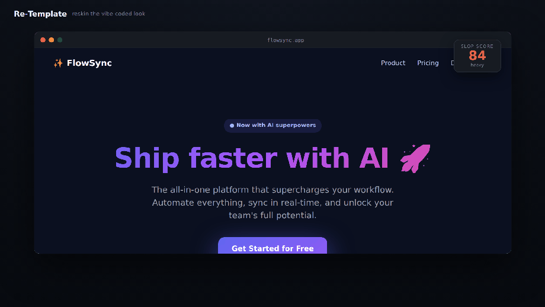
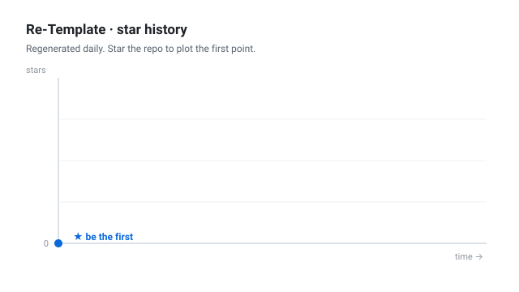
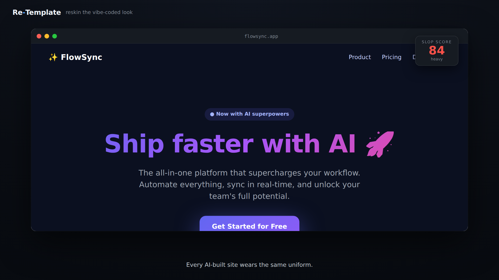
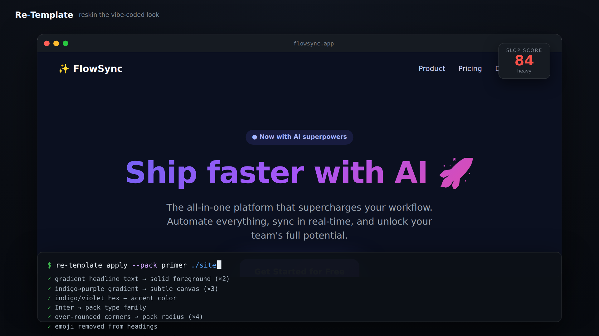
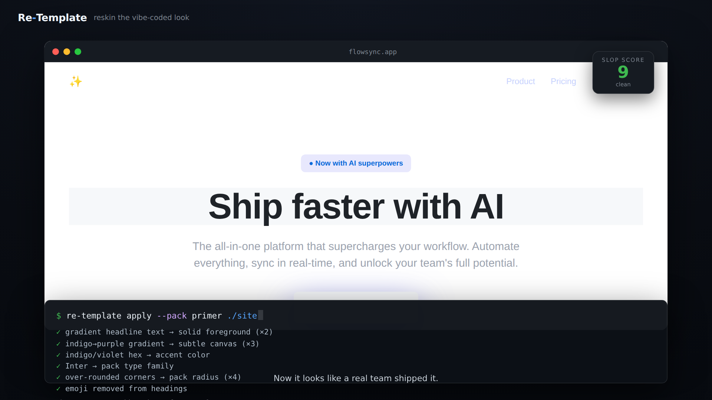
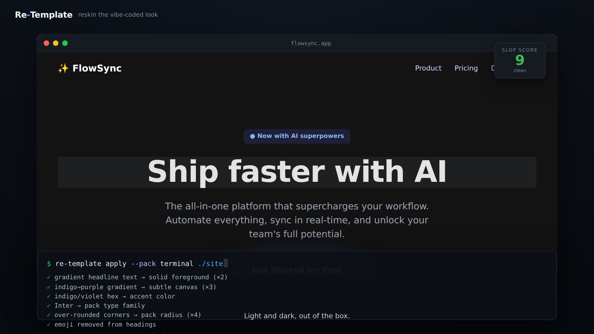

<div align="center">

# Re-Template

*Reskin AI-slop websites to a real design language —<br>detect the vibe-coded look, then replace it, don't just strip it.*



[](https://nodejs.org/)
[](package.json)
[](packs/)
[](test/)
[](LICENSE)

**[▶ Watch the demo](media/demo.webm)** · **[📊 The research](docs/RESEARCH.md)** · **[🎨 Brand packs](packs/)** · **[🧩 Contribute a pack](CONTRIBUTING.md)**

</div>

---

## Getting started & staying tuned with us.

Star us, and you will receive all release notifications from GitHub without any delay!

<a href="https://github.com/ninjahawk/Re-Template/stargazers">
 <picture>
   <!-- Chart is regenerated daily by .github/workflows/star-history.yml -->
   <source media="(prefers-color-scheme: dark)" srcset="media/star-history-dark.svg" />
   <source media="(prefers-color-scheme: light)" srcset="media/star-history.svg" />
   
 </picture>
</a>

---

## Overview

AI coding tools don't have taste — they have an *average*. Ask one for a landing
page and it returns the median of every Tailwind starter in its training data:
an indigo→purple gradient hero, Inter, a gradient-clipped headline, three feature
cards with emoji icons, a `Get Started` button that links to nothing. The look
has become as instantly datable as a 2015 WordPress theme, and it has a name:
*AI slop*, or *vibe-coded* design.

The tools that exist for this are **subtractive**. Detectors score your page and
leave. Strippers remove the tells and hand you something blander. Extractors pull
raw tokens out of a real site and wish you luck. None of them make your page
actually look like anything.

Re-Template is **additive**. It fingerprints the slop signature, then rewrites
the *system-level* choices — color, type, gradients, radius, elevation — so the
page inherits a real, opinionated design language (GitHub Primer, Google
Material, Shopify Polaris, IBM Carbon…) instead of the model's defaults. It
replaces the look; it does not just delete it. Detection and the reskin share one
source of truth, so every point of the score maps to a specific rewrite: *you
lost 24 points to indigo gradients — here are the three it replaced.*

Re-Template runs as a **zero-dependency CLI** (and, soon, an agent skill), works
on any HTML/CSS with no build step, and ships **brand packs** — one-file token
sets that anyone can contribute. It applies design *systems*, never a company's
*identity*: no logos, no wordmarks, nothing meant to pass your site off as
someone else's (see [Legal & scope](#legal--scope)).

## What a reskin does that a detector doesn't

The value is in the gap between *knowing* a page is slop and *fixing* it. Three
moments from the demo run on a stock vibe-coded landing page:

**1. The slop is measurable, and itemized.** The page scores **84/100**. Every
tell is named and priced — the indigo gradients, the clipped headline, Inter, the
emoji, the glow shadows — so the number is an explanation, not a verdict.



**2. The fix is a real transform, not a delete key.** `apply --pack terminal`
streams an explainable ledger: gradient headline → solid foreground, indigo hex →
accent color, Inter → the pack's type family, over-rounded corners → the pack's
radius, emoji removed from headings. Each line is a rewrite that actually ran.



**3. The result is a system, not a blank.** The same page, now inheriting the
Terminal pack — Roboto, a neutral grey scale, a single blue accent, tabular
numerals, hairline borders — **slop 9/100**. It doesn't look *stripped*; it looks
like a team with a design system shipped it.



**4. It ships light *and* dark, out of the box.** A pack with a dark role set
becomes theme-aware exactly the way a real design system does it — follow the OS
by default, honor an explicit `data-theme` override. Same page, one attribute:



## Reading the report

- **The score is 0–100 and additive.** Each tell contributes weighted points up
  to a per-tell cap, summed and clamped, so no single tell can max the score
  alone — heavy slop takes a *spread* of tells. `clean < 15 ≤ light < 40 ≤
  moderate < 70 ≤ heavy`.
- **Every finding is a named rule** with a per-hit weight, the number of hits,
  and the points charged. The rule set is one file — [`src/slop.js`](src/slop.js)
  — shared verbatim by the detector and the transformer.
- **`apply` prints the inverse:** the exact rewrites it performed and the
  before→after score, then writes the reskinned HTML (or edits in place with
  `-w`).
- **`diff`** shows what *would* change without writing anything.

```text
$ re-template score examples/slop/index.html

  Slop score  96 / 100   ███████████████████░  (heavy)

  Tells found:
  ● indigo→purple gradient background          ×3   +24
  ● gradient-clipped headline text             ×2   +14
  ● raw indigo/violet hex colors               ×7   +12
  ● emoji used as UI icons                     ×3   +12
  ● Inter / default system font, no type choice     +10
  ● over-rounded corners everywhere            ×4   +9
  ● emoji in headings                               +6
  ● pill "eyebrow" badge with leading dot      ×2   +6
  ● generic "Get Started" CTA                       +3
```

## Brand packs

A pack is a JSON file of design tokens plus a few rules. Launch packs are built on
**genuinely open-source design systems**, so the mapping targets a real,
documented system and the licensing is clean.

| Pack | Based on | License | Kind |
|------|----------|---------|------|
| `terminal` ⭐ | market-terminal convention (Google Finance-style) | CC0-1.0 | inspired-by |
| `poke500` | market-data index convention (finance-terminal style) | CC0-1.0 | inspired-by |
| `primer` | GitHub Primer | MIT | open-source |
| `material` | Google Material | Apache-2.0 | open-source |
| `polaris` | Shopify Polaris | MIT | open-source |
| `carbon` | IBM Carbon | Apache-2.0 | open-source |
| `editorial` | restrained editorial convention | CC0-1.0 | inspired-by |

The flagship **`terminal`** pack is the one in the demo above: Roboto, a Google-style
neutral grey scale, a single blue accent, semantic up/down colors, tabular numerals,
hairline borders, and a full **light + dark** theme. `inspired-by` packs capture a
*convention* as original token choices — never a copy of a proprietary system. Packs
are the growth loop: each one is a one-file PR. See [CONTRIBUTING.md](CONTRIBUTING.md).

## Method

```
HTML/CSS  ─▶  fingerprint      ─▶  map                ─▶  rewrite           ─▶  prove
              src/slop.js          pack tokens             src/apply.js          re-score
  parse raw    named tells,        type · color roles ·    gradients→solid,      before → after,
  markup +     weighted, capped    space · radius ·        Inter→pack sans,      itemized ledger,
  inline CSS   → 0–100 score       shadow · motion         hex→accent, emoji,    write .html / -w
                                                           inject token layer
```

Detection is pure pattern-matching over the raw markup and inline/`<style>` CSS —
no network, no build, deterministic. The transformer first **vaults** the regions
it must never touch (`<script>`, `<pre>`, `<textarea>`, comments), then classifies
components by their CSS signature and tags them by role, performs an ordered pass
of targeted rewrites driven by the pack's tokens and rules, and injects a single
`:root` token layer so even unstyled elements inherit the system — before
restoring the vaulted regions verbatim. Re-scoring the output closes the loop: the
drop *is* the receipt.

## Validation

```bash
npm test        # 40 tests, node:test, no network
```

The suite asserts the behavior the tool promises. For the **reskin**: the
canonical slop page scores *heavy* and flags its marquee tells by id; a
deliberately styled page scores *clean*; the score is clamped and monotonic; a
reskin drops the score by 40+ points to near-clean; gradient-clipped text and
indigo hexes are gone from the output; emoji leave headings and icon tiles while
the words stay; buttons and cards are re-proportioned; components are classified
by CSS signature regardless of class name; **`<script>`/`<pre>`/`<textarea>` are
never rewritten**; fixed-size shapes (avatars/icons) are not mistaken for pills;
form fields, labels, and tables are normalized; exactly one token layer is
injected; and re-applying never worsens the score. For the **reformat**: content
extraction yields a coherent model, cards become a hairline table, output is
deterministic and theme-aware, **no data is fabricated**, content is escaped, and
junk/empty/malformed input never throws — it always emits a valid page. Packs are
validated too — an incomplete pack, or one smuggling in a logo/wordmark/embedded
image, fails loudly.

## Setup

No install required:

```bash
npx re-template score ./site
npx re-template apply    --pack terminal ./site     # reskin: same skeleton, new paint
npx re-template apply    --pack terminal index.html -w
npx re-template reformat --pack poke500 index.html  # reformat: rebuild the skeleton
npx re-template diff  --pack material index.html
npx re-template packs
```

From source (Node 18+):

```bash
git clone https://github.com/ninjahawk/Re-Template
cd Re-Template
npm test
node bin/re-template.js score examples/slop/index.html
```

**Regenerating the demo.** The video is a real recording of the tool, not a
mockup. It needs the dev dependencies (Playwright + a pure-JS GIF encoder) and a
Chromium build:

```bash
npm install
node tools/build-demo.js     # renders the real before/after into the stage
node tools/record.js         # → media/demo.gif, media/demo.webm, media/still_*.png
```

## Reskin vs. reformat

There are two levels of "make it look like the author made it":

- **`apply` — reskin.** Keeps the page's structure and rewrites the *system-level*
  choices (color, type, gradients, radius, elevation) plus the author's house
  style (buttons, cards, kicker labels, nav, form fields, tables). Same skeleton,
  the author's paint. Components are recognized by their **CSS signature, not
  their class names** — a filled `<a>`/`<button>` is a primary action, a bordered
  padded block is a card, a full-pill label is a kicker — so the house style lands
  on the right elements no matter what a page named its classes. Executable regions
  (`<script>`, `<pre>`, `<textarea>`, comments) are left byte-for-byte untouched:
  a hex in `ctx.fillStyle='#8b5cf6'` is code, not a style token.
- **`reformat` — rebuild the skeleton.** Reads the page into a semantic content
  model (brand, headline, subhead, action, capabilities, footer) and re-emits it
  in the author's *layout grammar*: a slim top bar, a hero framed as a restrained
  quote, feature cards re-cast as a hairline **capabilities table**, a subscribe
  row, a footer. The output structure *is* the author's, so it can't drift off
  style, and it's deterministic — the same page always yields the same result.

`reformat` restructures **real content only** — it never fabricates metrics,
charts, or status badges, because injecting invented data into a real page would
misrepresent it. If the source has no capabilities to tabulate, the table is
simply omitted; a thin page still yields a coherent, valid page.

```bash
npx re-template reformat --pack poke500 index.html   # → index.reformat.html
```

## Limitations

Everything is **static analysis** of the served markup and its inline/`<style>`
CSS. It does not run a layout engine, so it only sees what's in the string it's
handed:

- **Runtime styles aren't reached.** CSS injected by JavaScript, CSS-in-JS, or
  external stylesheets the tool wasn't given are invisible — point it at the CSS
  you want read.
- **Canvas/JS-drawn pixels aren't reached, by design.** On an interactive app,
  `apply` reskins the *chrome* (nav, buttons, cards, headings) but cannot restyle
  colors a script paints onto a `<canvas>` or embeds in JS — those regions are
  deliberately left untouched so the app keeps working. The frame becomes the
  pack's; the playfield stays the author's.
- **`reformat` is for content pages.** It rebuilds a skeleton from extractable
  content (brand, headline, capabilities…). Point it at an app (a game, a
  canvas, a stateful UI) and it will emit a valid but empty shell — use `apply`
  there instead.
- **Extraction is heuristic.** Features are read as heading-plus-paragraph
  pairs; a page that structures them differently, or renders them via JavaScript,
  won't fully tabulate. It degrades to a smaller, clean page rather than failing.

Packs approximate a design system's *tokens* and layout conventions, not its full
component library. And the whole tool operates on *systems, not identities* by
design — reskinning to a real brand's exact look-and-feel is out of scope, not a
missing feature.

## Legal & scope

You generally **cannot copyright a UI's look-and-feel or layout** — a menu
hierarchy is an uncopyrightable "method of operation" (*Lotus v. Borland*), and
reimplementing an interface can be fair use (*Google v. Oracle*). What *is*
protected is the expressive content *inside* the interface — logos, wordmarks,
original icon artwork, source code — and, under trademark law, a distinctive
**trade dress** that has acquired secondary meaning, where the violation is
consumer *confusion* as to source. Re-Template is engineered around that line: it
applies design *systems*, ships no identity assets, and is not an impersonation
tool. Full case law and sources are in [docs/RESEARCH.md](docs/RESEARCH.md). None
of this is legal advice.

## Acknowledgements

The open-source launch packs are built on design systems by their respective
teams: [Primer](https://primer.style) (GitHub), [Material](https://m3.material.io)
(Google), [Polaris](https://polaris.shopify.com) (Shopify), and
[Carbon](https://carbondesignsystem.com) (IBM). The flagship `terminal` pack and
`editorial` are `inspired-by` presets — original token choices that evoke a public
*convention* (a Google Finance-style market terminal; a restrained editorial feel),
not copies of any proprietary system. Re-Template is an independent project and is
not affiliated with, endorsed by, or sponsored by any of them.

Licensed under [MIT](LICENSE).
